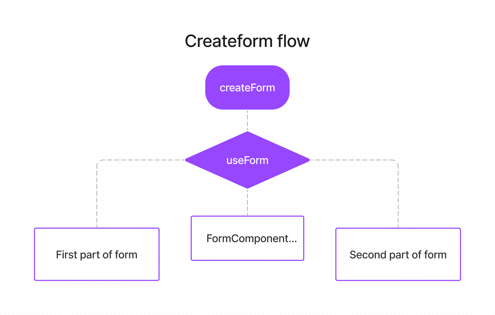

<h1 align="center">Createform 👋</h1>
<h2 align="center">The ReactJS form library</h2>

[](https://github.com/Jucian0/useformcreateform/blob/master/LICENSE)
[](https://github.com/jucian0/createform/tree/master/test)
[](https://twitter.com/intent/tweet?text=React+hook+for+forms+and+validations&url=https://github.com/jucian0/createform&hashtags=reactjs,hook,javascript,forms)
[](https://www.npmjs.com/package/@createform/react)


## Introduction

Createform is a ReactJS library that makes it easy to create forms. It offers two different approaches for managing forms: creating a custom hook with the `createForm` function and using the `useForm` hook.

## `createForm()`

Createform provides a unique approach to form management by guiding you to create custom hooks using the `createForm` function. This allows you to use the same form in different components without relying on the React Context API.

- Similar to other packages, you can also use Yup or Zod validation to validate your forms.
- You have the flexibility to handle your forms using different approaches such as `onSubmit`, `onChange`, or `debounce`.
- Requires less code compared to other options.

### How it works

Createform utilizes an external store to maintain the form state. However, to share the state with other components without using React Context, it provides the `createForm` function. This function creates a form and returns a hook that is connected to the store. Whenever the store changes, the hook is notified, and the form is updated.

In other words, the `createForm` function creates a form and returns a hook that includes all the necessary resources to manage the form. If you use this hook multiple times, it refers to the same form and store, enabling the use of the same form in different components without providers or the React Context API.



### Reasons to use Createform

There are several motivations for using a custom form hook created by `createForm` in a React application. Some of these motivations include:

- **Reusability**: Using a custom form hook created by `createForm` allows you to reuse the same form logic across multiple components in your application. This eliminates the need to duplicate form handling code, saving time and making your code more organized and maintainable.

- **Flexibility**: With a custom form hook created by `createForm`, you have the flexibility to customize the behavior of your forms and define their functionality according to your specific requirements. This includes features like input validation and form data submission to an API.

- **Simplicity**: Working with forms in your React application becomes easier with a custom form hook created by `createForm`. By abstracting the details of form handling, you can focus on the core logic of your application and avoid complexities associated with form management.

- **Separation of concerns**: A custom form hook created by `createForm` allows you to separate the concerns of form handling and data management from the rest of your application. This simplifies testing and maintenance, while improving the overall organization and structure of your application.

## `useForm()`

The second approach is to use the `useForm` hook. This approach provides an easy way to manage forms, differing from `createForm()`. You don't need to register each input individually; instead, you can register the entire form element. `useForm` utilizes native events and APIs to handle the inputs.

`useForm` does not use React state to manage the form state; it only stores form errors in case of validation issues.

## What to expect with Createform

Regardless of the approach you choose, here's what you can expect when using Createform:

- **Performant forms**: Createform allows you to complete and submit forms without triggering unnecessary rerenders. By default, Createform creates uncontrolled forms.
- **Simplified coding**: Createform provides an intuitive way to write forms with less code. The `register` function returns the necessary properties for each input, which is all you need to manage input events using native HTML `input` elements. You can write forms without the need for a `<form>` tag.
- **Easy validation** - By default Createform uses yup validation, we can write complex validation without effort.

## Installation

```bash
npm install --save @createform/react
```

```bash
yarn add @createform/react
```

## `createForm()` usage

### First create your form

The first step is to create your form with the `createForm` function, this function returns a hook that you can use to manage your form, wherever you want to use.

```javascript
import { createForm } from "@createform/react";

export const useLoginForm = createForm({
  initialValues: {
    email: "jucian0@jucian0.com",
    password: "yourpassword",
  },
});
```

### Second use it in your component

The second step is to create a component to render your form, you can use the `useLoginForm` hook to get the form state and manage it.

```jsx
import { useLoginForm } from "./useLoginForm.js";

const LoginForm = () => {
  const { handleSubmit, register } = useLoginForm();

  function onSubmit(values) {
    console.log(values);
  }

  return (
    <form onSubmit={handleSubmit(onSubmit)}>
      <input type="email" {...register("email")} />
      <input type="password" {...register("password")} />
      <button type="submit">Submit</button>
    </form>
  );
};
```

## `useForm()` usage

More native way to create forms.

```javascript
import { useForm } from "@createform/react";

export function LoginForm() {
  const { register } = useForm({
    initialValues: {
      email: "jucian0@jucian0.com",
      password: "yourpassword",
    },
    onSubmit,
  });

  function onSubmit(values) {
    console.log(values);
  }

  return (
    <form {...register()}>
      <input type="email" name="email" />
      <input type="password" name="password" />
      <button type="submit">Submit</button>
    </form>
  );
```

## It's All.

## Read the full documentation [here](https://useform.org/quick-start).

## 🤝 Contributing

Contributions, issues and feature requests are welcome!<br />Feel free to check [issues page](https://github.com/jucian0/createform/issues). You can also take a look at the [contributing guide](https://github.com/Jucian0/createform/blob/main/CONTRIBUTING.md).

### Ways to Contribute

- **Code Contributions:** If you are a developer, you can help us improve the project by contributing code. You can find our project on GitHub [here](https://github.com/jucian0/createform), where you can create issues, fork the project, make changes, and submit pull requests.

- **Documentation:** We are always looking for help with documentation. If you have expertise in the project or have experience writing technical documentation, we would appreciate your contributions.

- **Bug Reports:** If you find a bug, please report it! You can create a new issue on GitHub and provide as much information as possible. This will help us reproduce the issue and fix it quickly.

- **Feature Requests:** If you have a feature request, please let us know by creating a new issue on GitHub. We welcome feedback and ideas for how to improve the project.

- **Spread the Word:** If you like our project, you can help us by sharing it with others. Tell your friends, colleagues, or anyone who might be interested. You can also follow us on social media and share our posts.

## Show your support

Give a ⭐️ if this project helped you!

[](https://github.com/jucian0/createform/stargazers)

## 📝 License

Copyright © 2023 [jucian0](https://github.com/jucian0).<br />
This project is [MIT](https://github.com/jucian0/createform/blob/53debd6986650f76561795f2069d6eebc5db6c65/LICENSE) licensed.
